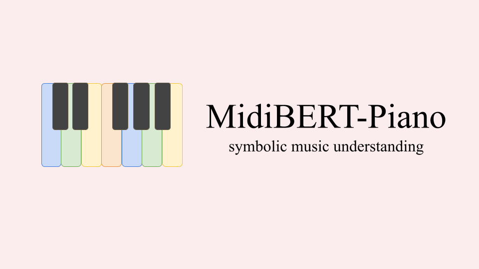

# MidiBERT-Piano
<p align="center">
    
    <br>
    <a href="LICENSE"></a>
    <a href="http://arxiv.org/licenses/nonexclusive-distrib/1.0/"> </a>
    <a href=""> </a>
    <a href="https://github.com/wazenmai/MIDI-BERT/issues"></a>

</p>
Authors: <a href="https://sophia1488.github.io">Yi-Hui (Sophia) Chou</a>, <a href="https://github.com/wazenmai">I-Chun (Bronwin) Chen</a>

## Introduction
This is the official repository for the paper, [MidiBERT-Piano: Large-scale Pre-training for Symbolic Music Understanding](https://arxiv.org/pdf/2107.05223.pdf).

With this repository, you can
* pre-train a MidiBERT-Piano with your customized pre-trained dataset
* fine-tune & evaluate on 4 downstream tasks
* extract melody (mid to mid) using pre-trained MidiBERT-Piano

All the datasets employed in this work are publicly available.


## Quick Start
### For programmers
If you'd like to reproduce the results (MidiBERT) shown in the paper, 


1. Please download the [checkpoints](https://drive.google.com/drive/folders/1ceIfC1UugZQHPgpEEMkdAF0VhZ1EeLl3?usp=sharing), and rename files like the following

	(Note: we only provide checkpoints for models in CP representations)
```
result/
└── finetune/
	└── melody_default/
		└── model_best.ckpt
	└── velocity_default/
		└── model_best.ckpt
	└── composer_default/
		└── model_best.ckpt
	└── emotion_default/
		└── model_best.ckpt
```

2. Run `./scripts/eval.sh`

	Or refer to Readme in MidiBERT folder for more details. 
 
	*No gpu is needed for evaluation*

### For musicians who want to test melody extraction
Edit `scripts/melody_extraction.sh` and modify `song_path` to your midi path.
The midi file to predicted melody will be saved at the root folder.
```
./scripts/melody_extraction.sh
```
#### Windows Users
```
# modify this line (export PYTHONPATH='.') to the following
set PYTHONPATH='.'
# print the environment variable to make sure it's working
echo %PYTHONPATH%
```
I've experimented this on Adele hello (piano cover), and I think it's good.  
But for non-pop music like Mozart sonata, I feel like the model is pretty confused.  This is expected.  As the training data is POP909 Dataset, the model knows very little about classical music.  

Side note: I try to make it more friendly for non-programmers.  Feel free to open an issue if there's any problem.

## Installation
* Python3
* Install generally used packages for MidiBERT-Piano:
```python
git clone https://github.com/wazenmai/MIDI-BERT.git
cd MIDI-BERT
pip install -r requirements.txt
```

## Usage
Please see `scripts` folder, which includes bash file for
* prepare data
* pretrain
* finetune
* eval
* melody extraction

You may need to change the folder/file name or any config settings you prefer.


## Repo Structure
```
Data/
└── Dataset/       
    └── pop909/       
    └── .../
└── CP_data/
    └── pop909_train.npy
    └── *.npy

data_creation/
└── preprocess_pop909/
└── prepare_data/       # convert midi to CP_data 
    └── dict/           # CP dictionary 

melody_extraction/
└── skyline/
└── midibert/

MidiBERT/
└── *py

```

## More
For more details on 
* data preparation, please go to `data_creation` and follow Readme
* MidiBERT pretraining, finetuning, evaluation, please go to `MidiBERT` and follow Readme
* skyline, please go to `melody_extraction/data_creation` and follow Readme

Note that Baseline (LSTM) and code in remi versions are removed for cleaness.  But you could find them in `main` branch.

## Citation

If you find this useful, please cite our paper.

```
@article{midibertpiano,
  title={{MidiBERT-Piano}: Large-scale Pre-training for Symbolic Music Understanding},
  author={Yi-Hui Chou and I-Chun Chen and Chin-Jui Chang and Joann Ching, and Yi-Hsuan Yang},
  journal={arXiv preprint arXiv:2107.05223},
  year={2021}
}
```

