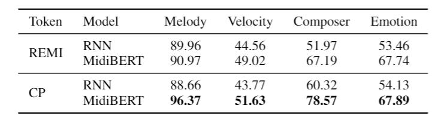

# MidiBERT-Piano
[TODO] add a figure?
<p align="center">
    <a href="./LICENSE"></a>
    
</p>
Authors: Yi-Hui Chou, I-Chun Chen

## Introduction
[TODO] add arxiv link here and citation

This is the official repository for the paper, [MidiBERT-Piano: Large-scale Pre-training forSymbolic Music Understanding]().

With this repository, you can
* pre-train a MidiBERT-Piano with your customized pre-trained dataset
* fine-tune & evaluate on 4 downstream tasks
* compare its performance with a Bi-LSTM

All the datasets employed in this work are publicly available.


## Quick Start
If you'd like to reproduce the results (MidiBERT) shown in the paper, 


1. please download the [checkpoints](https://drive.google.com/drive/folders/1ceIfC1UugZQHPgpEEMkdAF0VhZ1EeLl3?usp=sharing), and rename files like the following

```
MidiBERT/{CP/remi}/
result
└── finetune
	└── melody_default
		└── model_best.ckpt
	└── velocity_default
		└── model_best.ckpt
	└── composer_default
		└── model_best.ckpt
	└── emotion_default
		└── model_best.ckpt
```

2. please refer to <a href="#2-evaluation">evaluation</a>.  

, and you are free to go!  *(btw, no gpu is needed for evaluation)*


## Installation
[TODO] add a requirement file! (有可以自動抓package的code)
* Python3
* Install generally used packages for MidiBERT-Piano:
```python
>>> git clone https://github.com/wazenmai/MIDI-BERT.git
>>> cd MIDI-BERT
>>> pip install -r requirements.txt
```


## A. Prepare Data

All data in CP/REMI token are stored in ```data/CP``` & ```data/remi```, respectively, including the train, valid, test split.

You can also preprocess as below.

### 1. download dataset and preprocess

* [Pop17K](https://github.com/YatingMusic/compound-word-transformer)
* [ASAP](https://github.com/fosfrancesco/asap-dataset)
  * Step 1: Download ASAP dataset from the link
  * Step 2: Use `Dataset/ASAP_song.pkl` to extract songs to `Dataset/ASAP`
* [POP909](https://github.com/music-x-lab/POP909-Dataset)
  * preprocess to have 865 pieces in qualified 4/4 time signature
  * ```exploratory.py``` to get pieces qualified in 4/4 time signature and save at ```qual_pieces.pkl```
  * ```preprocess.py``` to realign and preprocess
  * Special thanks to Shih-Lun (Sean) Wu
* [Pianist8](https://zenodo.org/record/5089279)
  * Step 1: Download Pianist8 dataset from the link
  * Step 2: Use `Dataset/pianist8_(mode).pkl` to extracts songs to `Dataset/pianist8/mode`
* [EMOPIA](https://annahung31.github.io/EMOPIA/)
  * Step 1: Download Emopia dataset from the link
  * Step 2: Use `Dataset/emopia_(mode).pkl` to extracts songs to `Dataset/emopia/mode`

### 2. prepare dict

```dict/make_dict.py``` customize the events & words you'd like to add.

In this paper, we only use *Bar*, *Position*, *Pitch*, *Duration*.  And we provide our dictionaries in CP & REMI representation.

```dict/CP.pkl```

```dict/remi.pkl```

### 3. prepare CP & REMI

```./prepare_data/CP```

* Run ```python3 main.py ```.  Please specify the dataset and whether you wanna prepare an answer array for the task (i.e. melody extraction, velocity prediction, composer classification and emotion classification).
* For example, ```python3 main.py --dataset=pop909 --task=melody --dir=[DIR_TO_STORE_DATA]```

```./prepare_data/remi/```

* The same logic applies to preparing REMI data. 

Acknowledgement: [CP repo](https://github.com/YatingMusic/compound-word-transformer), [remi repo](https://github.com/YatingMusic/remi/tree/6d407258fa5828600a5474354862353ef4e4e8ae)

You may encode these midi files in different representations, the data split is in ***.

## B. Pre-train a MidiBERT-Piano

```./MidiBERT/CP``` and ```./MidiBERT/remi```

* pre-train a MidiBERT-Piano
```python
>>> python3 main.py --name=default
```
A folder named ```CP_result/pretrain/default/``` will be created, with checkpoint & log inside.

* customize your own pre-training dataset
Feel free to select given dataset and add your own dataset.  To do this, add ```--dataset```, and specify the respective path in ```load_data()``` function.
For example,
```python
# to pre-train a model with only 2 datasets
>>> python3 main.py --name=default --dataset pop1k7 asap	
``` 

Acknowledgement: [HuggingFace](https://github.com/huggingface/transformers)

Special thanks to Chin-Jui Chang

## C. Fine-tune & Evaluate on Downstream Tasks

```./MidiBERT/CP``` and ```./MidiBERT/remi```

### 1. fine-tuning

* ```finetune.py```
```python
>>> python3 finetune.py --task=melody --name=default
```
A folder named ```CP_result/finetune/{name}/``` will be created, with checkpoint & log inside.

### 2. evaluation

* ```eval.py```
```python
>>> python3 eval.py --task=melody --cpu --ckpt=[ckpt_path]
```
Test loss & accuracy will be printed, and a figure of confusion matrix will be saved.

*The same logic applies to REMI representation.*

## D. Baseline Model (Bi-LSTM)

```./baseline/CP``` & ```./baseline/remi```

We seperate our baseline model to note-level tasks, which used a Bi-LSTM, and sequence-level tasks, which used a Bi-LSTM + Self-attention model.

* Train a Bi-LSTM
	* note-level task
	```python
	>>> python3 main.py --task=melody --name=0710
	```
	* sequence-level task
	```python
	>>> python3 main.py --task=composer --output=0710
	```

* Evaluate
In note-level task, please specify the checkpoint name.
In sequence-level task, please specify only the output name you set when you trained.
	* note-level task
	```python
	>>> python3 eval.py --task=melody --ckpt=result/melody-LSTM/0710/LSTM-melody-classification.pth
	```
	* sequence-level task
	```python
	python3 eval.py --task='composer' --ckpt=0710
	```

The same logic applies to REMI representation. 

Special thanks to Ching-Yu (Sunny) Chiu

## E. Skyline

Get the accuracy on pop909 using skyline algorithm
```python
>>> python3 cal_acc.py
```

Since Pop909 contains *melody*, *bridge*, *accompaniment*, yet skyline cannot distinguish  between melody and bridge.

There are 2 way to report its accuracy:

1. Consider *Bridge* as *Accompaniment*, attains 78.54% accuracy
2. Consider *Bridge* as *Melody*, attains 79.51%

Special thanks to Wen-Yi Hsiao for providing the code for skyline algorithm.

## Citation

If you find this useful, please cite our paper.

```
@article{
	title={MidiBERT-Piano: Large-scale Pre-training forSymbolic Music Understanding},
	author={Yi-Hui Chou*, I-Chun Chen*, Chin-Jui Chang, Joann Ching, and Yi-Hsuan Yang},
	year={2021},
}
```

